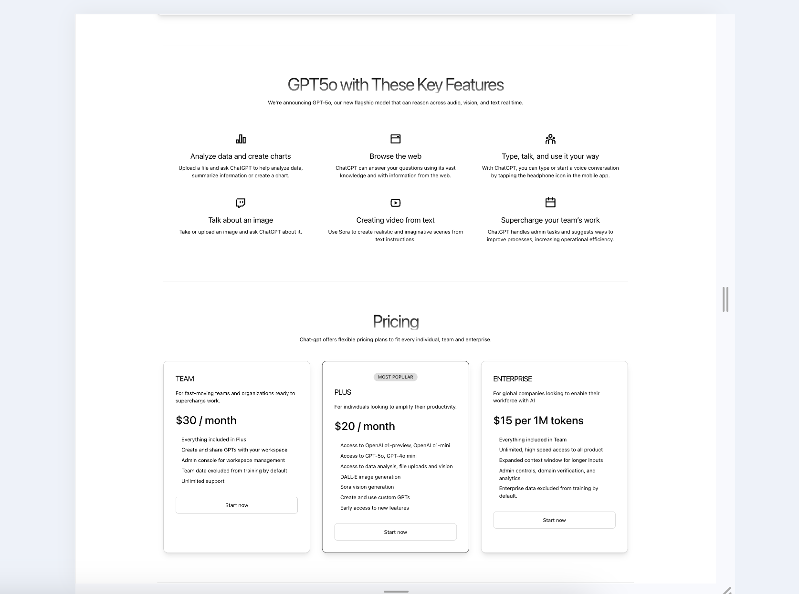

# Saas platform simulation project - Open-AI ChatGPT-5o

## Project pictures

## Description

This project is a Saas (Software as a Service) platform simulation that utilizes OpenAI's ChatGPT-5o model. The goal of the project is to create a responsive frontend application with framer motion.

## Features

- Frontend application with framer motion
- Responsive design
- Links to webpage of the project

## Technologies

- React
- Framer motion
- Tailwind CSS
- V0-dev/claude

## Installation

1. Clone the repository.
   git clone [项目的 Git 仓库地址]

2. Navigate to the project directory.
   cd /Saas_frontend

3. Run the following command to install the dependencies:
   npm install

## local run

1. Run the following command:
   npm run dev

2. Open your browser and navigate to [http://localhost:5173/](http://localhost:5173/).
